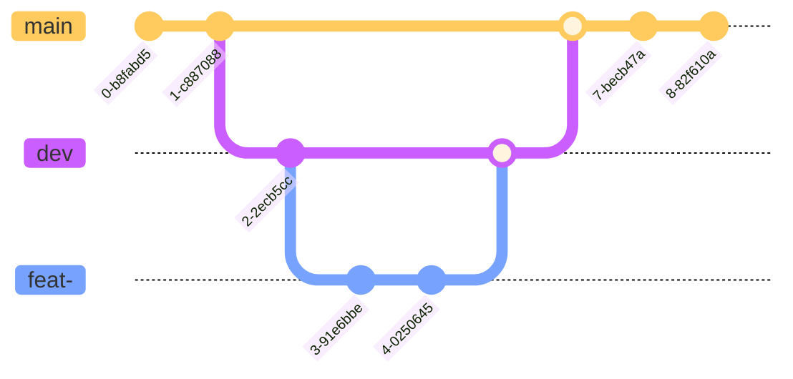

# How to contribute

Thank you for investing your time in contributing to our website! Any
contribution you make will be reflected on DS3 Website ✨.

Read our [Code of Conduct](./CODE_OF_CONDUCT.md) to keep our community
approachable and respectable.

In this guide you will get an overview of the workflow from opening an issue,
creating a PR, reviewing, and merging the PR.

## New Contributor Guide

To get an overview of the project, read the [README](./README.md) and also the
[SUPPORT](./SUPPORT.md) to ensure you local environment is setup correctly. Here
are some resources to help you get started with contributions.

## Git Branch Strategy

| Branch Category             | Description                                                                                                                                                                                                                                                                                                                      |
| --------------------------- | -------------------------------------------------------------------------------------------------------------------------------------------------------------------------------------------------------------------------------------------------------------------------------------------------------------------------------- |
| `main`: _Production Branch_ | <ul><li>Used for the Production Site, which will seen by our end users</li><li>**Accepted Branch Merges**: `dev` (Only done by Director(s))</li><li>All commits to this brach must be tested and approved before they are merged</li></ul>                                                                                       |
| `dev`: _Development Branch_ | <ul><li>Used for the Development Site, which will be seen only by the DS3 members</li><li>Used to verify new changes are working correctly before pushed to the Production Site</li><li>**Accepted Branch Merges**: `feat-`, `bug-`, `chore-`</li> <li>All commits to this brach must be tested before they are merged</li></ul> |
| `feat-`: _Feature Branch_   | Adding or Modifying a feature                                                                                                                                                                                                                                                                                                    |
| `bug-`: _Bug Fix Branch_    | Fixing a bug in `develop` or `main` branch                                                                                                                                                                                                                                                                                       |
| `chore-`: _Chore Branch_    | Anything else (Documentation, Formatting, Linting Changes)                                                                                                                                                                                                                                                                       |

### Branch Naming Conventions

When you create any of these branches _(`feat`, `bug`, `chore`)_ ensure it
follows this convention for the branch name: **category/#reference/description**

- **category**: `feat`, `bug`, `chore`
- **reference**: The Issue Number on GitHub or it can be `non-ref` if one does
  not exist
- **description**: Meant to be a brief description of the branch

**Examples**: `feat/#1/nav-bar`, `bug/#10/nav-link-issue`, `chore/#3/updated-lint-rules`

## Making a Suggestion

We use [GitHub Issues](https://github.com/theDS3/Website/issues) to manage all
our bugs and suggestions for the project.

If you spot a problem with the Website or would like to add a feature

1. Search for related issues
   - If you find a related issue just add to the issue
2. No related issue found
   - Open up an new issue using a relevant [issue form](https://github.com/theDS3/Website/issues/new/choose).
   - Send a message to one of the Directors about the issue with the GitHub Issue
     Link

## Making Changes

Before you get started with working on an issue, ensure that you have read
through the [SUPPORT](./SUPPORT.md) to make sure that you all things configured
correctly on your local machine.

### Coding Conventions

- Try to create a reusable component, this will help to reduce duplicate code.
- Introduce typing and validation anywhere possible. There is a reason why we
  use Typescript instead of Javascript.
- Try to consider as many edge cases as possible while dealing with variables
  and components.
- `ESLint` and `Prettier` enable developers to have a consistent code style throughout
  the codebase. However, to have a working app, all the exceptions by `ESLint` are
  set to warn the developer (i.e. they won’t force developers to change it
  before starting the app). Still, whenever a linting error is seen, it should
  be fixed

### Making Commits

- Follow the [Conventional Commits Guideline](https://www.conventionalcommits.org/en/v1.0.0/#summary)
  - We use a
    [VS Code Extension](https://marketplace.visualstudio.com/items?itemName=vivaxy.vscode-conventional-commits&ssr=false#overview)
    to help you follow this guideline
  - It will be used to create CHANGELOGs for each release
- Commit such that your changes are small but logically related
  - This will help the reviewer to understand the process toward the destination
- Start your commit message with a verb and describe what your commit changed.
  - Example: Added new component to the About Page.
  - Example: Optimized the Search By Title using Indexing.
- Try not to have long commit titles, a 50-character limit is a good practice
  that should not be ignored.
- Utilize the description field if you need to go into more detail about the
  commit which the title could not

## Testing

Testing your changes is very important to ensure that you have actually
fixed the problem, and it has has not caused other parts of the website to
break. End of the day what is visible on the screen is the only thing that
matters to the end users. Here are some things look out for and suggested
tools to assist:

- Responsiveness: Ensuring that components and pages are designed to scale to
  the user’s screen size orientation and other preferences is important to
  providing a great user experience. The apps below will help with simulating
  these user preferences and provide a way to visually inspect changes.
  - [Responsively App](https://responsively.app/)
  - [Responsive Viewer](https://responsiveviewer.org/) (Chrome Only)
- Consistency: Ensuring that interactions across the site should be the same for
  similar components to prevent users from getting confused.
- Accessibility: Ensuring the site is available for all users is important,
  especially for individuals with
  disabilities and special needs. The site below will test for various issues
  including accessibility.
  - [PageSpeed Insights](https://pagespeed.web.dev/)
- Cross-Browser Compatibility: Ensuring the user experience is consistent no
  matter the Browser being used. It would also be more effective if the test was
  run on various OS and Device combinations

## Submitting Changes

We use [GitHub Pull Requests](https://github.com/theDS3/Website/pulls) to submit
new changes for the project.

### Creating Pull Requests

When you're finished with the changes and have completed testing, create a pull
request, also known as a PR.

- Ensure that the merge is set between the correct branches:
  - **DO NOT SETUP PR BETWEEN `dev` AND `main`** - This is only done by the Directors.
  - Most cases your PR will be an to the **`dev`** branch. This merges your
    changes to the development site once approved on GitHub.
- Use the given PR template so that we can review your PR. This template helps
  reviewers understand your changes as well as the purpose of your pull request.
- Don't forget to
  [link PR to issue](https://docs.github.com/en/issues/tracking-your-work-with-issues/linking-a-pull-request-to-an-issue)
  if you are solving one.
- Include all members relevant to the issue also to the PR

### Submitting Pull Requests

Once you submit your PR, a team member will review your proposal. We may ask
questions or request for additional information.

- We may ask for changes to be made before a PR can be merged, either using
  [suggested changes](https://docs.github.com/en/github/collaborating-with-issues-and-pull-requests/incorporating-feedback-in-your-pull-request)
  or pull request comments.
- You can make those relevant changes in your branch, then commit them to your branch.
- As you update your PR and apply changes, mark each conversation as [resolved](https://docs.github.com/en/github/collaborating-with-issues-and-pull-requests/commenting-on-a-pull-request#resolving-conversations).
- If you run into any merge issues, checkout this
  [git tutorial](https://github.com/skills/resolve-merge-conflicts) to help you
  resolve merge conflicts and other issues.

## Your changes are merged

Congratulations 🎉🎉 The DS3 Web Development team thanks you ✨.

Once your PR has been approved, by the end of the week the PR will be merged to
the appropriate branch and all changes will be up on the respective shortly after.
